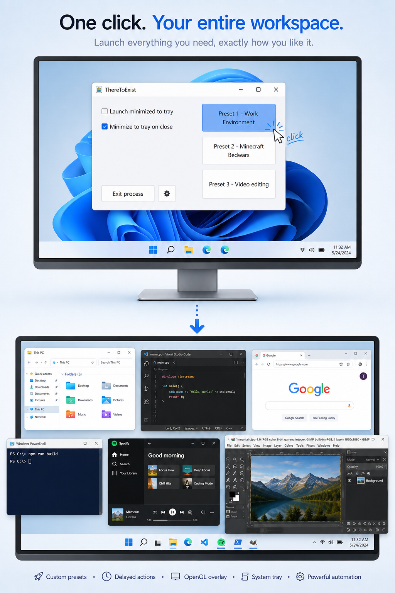

Set Windows clock resolution to 1ms instead of the default 15.625ms for higher precision in the framerate# ThereToExist

A minimal Windows utility that puts everything you need behind just one single click. Automate sequences of actions, launch external programs, toggle a GPU profile, and much more!

    
    <small>(this example is AI generated)</small>

## Features

- Configurable presets running sequences of actions
- Delayable auto-launch functionality for each preset
- Customizable OpenGL Overlay, supports hooks such as RTSS
- Clean system tray integration
- Proper multi instance support
- Runs on Windows XP and later
- Extremely lightweight

## Download

Grab the latest release from the [Releases page]

## How to use

See the [wiki](/../../wiki) for explanations on all functionalities.

## Why

I wanted a single lightweight tool that could trigger NVIDIA's Advanced Optimus (which is essentially a MUX switch without a reboot), before launching my Minecraft Speedrunning environment. Said environment includes utilities that would crash during the GPU toggle (sometimes even the game itself depending on the version). At the same time, I wanted that tool to be able to launch it all with just one click.

ThereToExist does not assume what you'll use it for. It's a versatile tool meant to serve as a trigger for anything you may want.

## Requirements

Just Windows lol, as long as it's at least Windows XP.

> Required disk space is also negligible, at less than 1MB currently

## Security

1. On its own, this program does NOT communicate with any remote server or networked system, but can be made to execute separate programs or commands that do if configured so by the user.

2. Administrator privileges are absolutely not required for this program to operate, though they can be beneficial (see [wiki](/../../wiki#32-settings-opengl))
